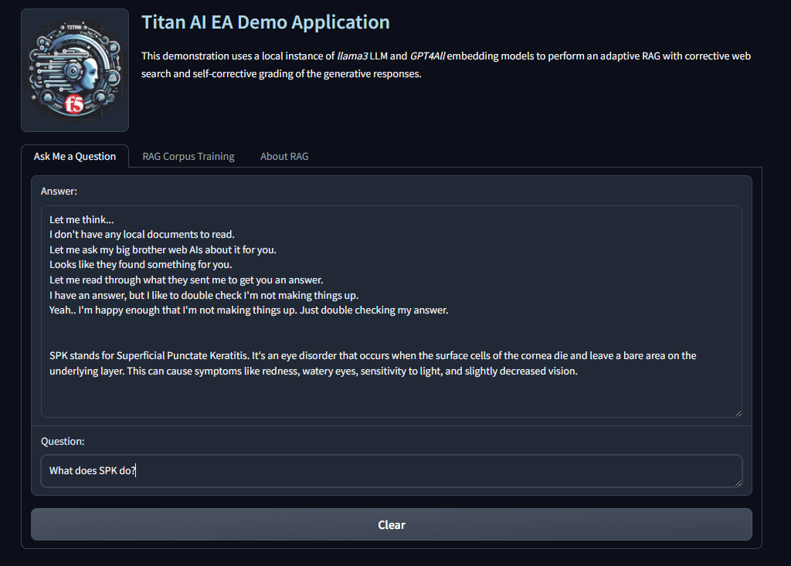
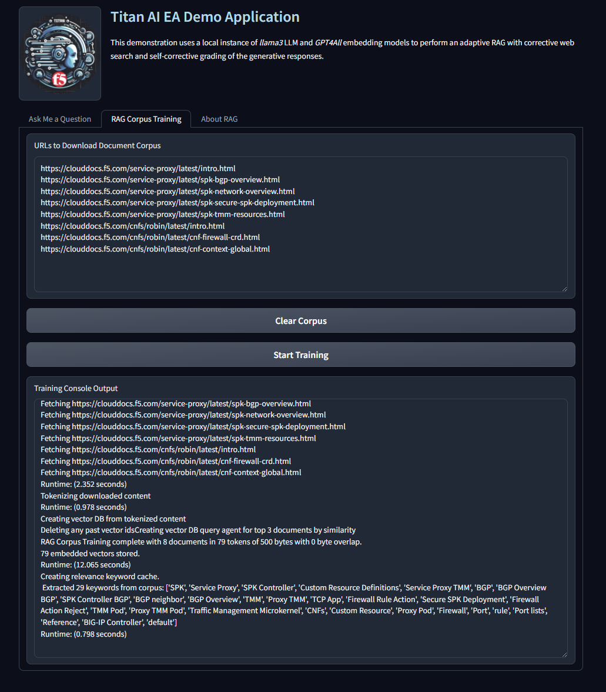
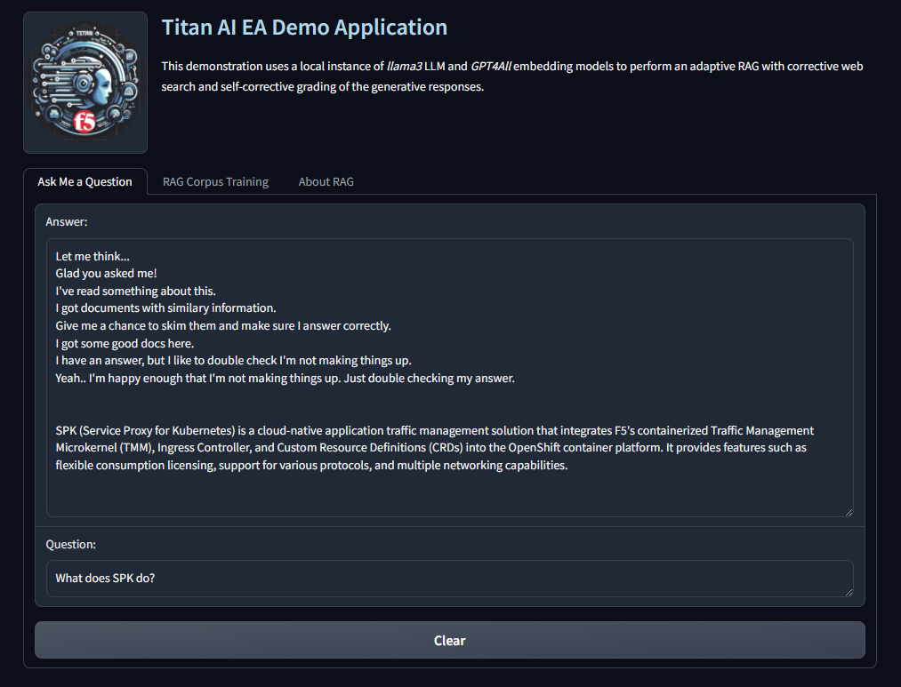
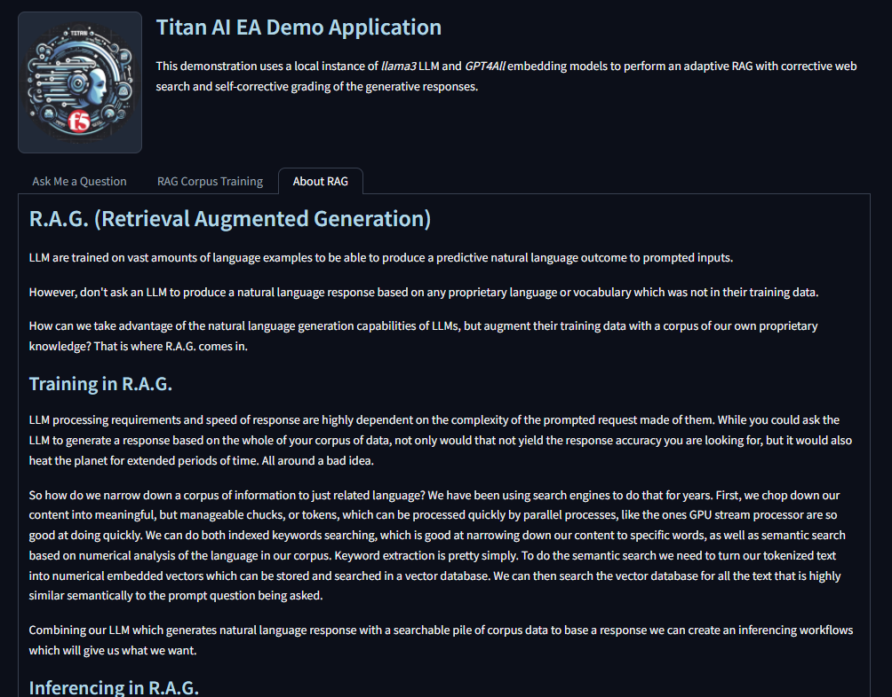

# titan_ea_demo
Titan Project EA Real Word AI Application

## How to Run with Docker

`docker compose up --build`

## Environment Variables

`OLLAMA_HOST`=The FQDN or IP of the host running ollama server

`CHROMADB_HOST`=The FQDN or IP of the host running chromadb server

`LANGCHAIN_TRACING_V2='true'` - Turns on langchain tracing

`LANGCHAIN_ENDPOINT='https://api.smith.langchain.com'` - langchain tracing endpoint

`LANGCHAIN_API_KEY`=langchain smith tracing project API key (free tier is fine)

`TAVILY_API_KEY`=tavily.com web search API key (free tier is fine)

## Run Locally

Define the environment variables in your shell.

Within the project directory do this:

`$ python3 -m venv .venv`

`$ . .venv/bin/activate`

`$ pip install -r requirements.txt`

`$ python3 -m titan_ea_demo`

## How to Use

The default user interface is exposed on port 7860.

`http://localhost:7860`

You can start by asking a question and hitting ENTER. Because there is not corpus of documents for RAG found,
the agent application will do a web search on your qustion and then let the LLM generate you an answer.

If you want to add local documents for RAG to your agents corpus of local information, select the *RAG Corpus Training* tab.

From here you can use the default URLs to HTML documents or provide your own URLs to HTML documents. (HTML only)

After you have your list of HTML documents to use for RAG, press the *Start Training* button.

Now you can go back to the *Ask Me a Question* tab and ask a question which should be answered from your RAG documents and see what happens now.

If you want to know more about what all is implemented in our AI agent workflow, select the *About RAG* tab and read.

