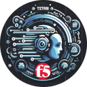

# titan_ea_demo
Titan Project EA Real Word AI Application

## How Run

`docker compose up --build`

## Environment Variables

`OLLAMA_HOST`=The FQDN or IP of the host running ollama server

`CHROMADB_HOST`=The FQDN or IP of the host running chromadb server

`LANGCHAIN_TRACING_V2='true'` - Turns on langchain tracing

`LANGCHAIN_ENDPOINT='https://api.smith.langchain.com'` - langchain tracing endpoint

`LANGCHAIN_API_KEY`=langchain smith tracing project API key (free tier is fine)

`TAVILY_API_KEY`=tavily.com web search API key (free tier is fine)

## Run Locally

Define the environment variables in your shell.

Within the project directory do this:

`$ python3 -m venv .venv`

`$ . .venv/bin/activate`

`$ pip install -r requirements.txt`

`$ python3 -m titan_ea_demo`

